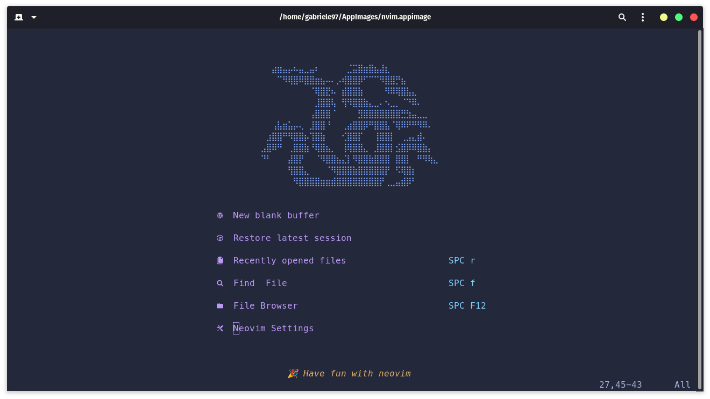
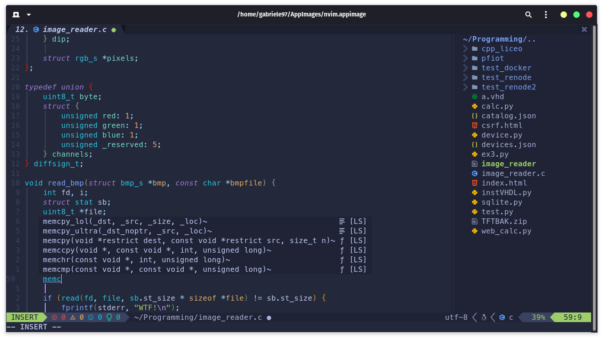
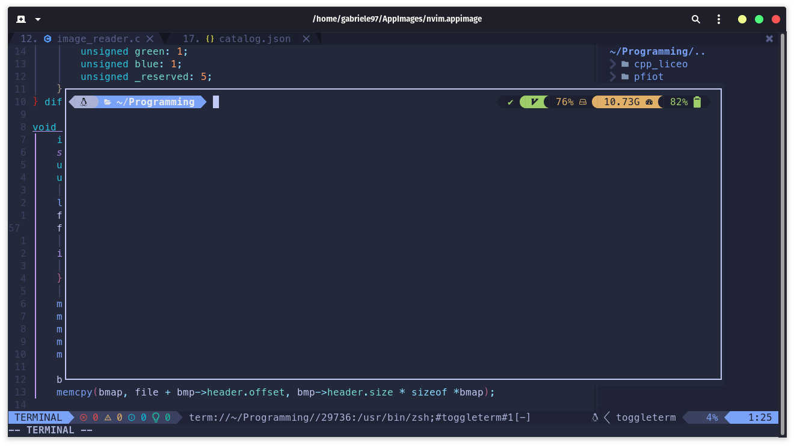

# Neovim Configuration





## About

This repository contains my main configurations, including key mappings, plugins, and other settings for Neovim. 
I'm primarily working with C, C++ and Python for embedded projects.

## Quickstart
- Install [vim-plug](https://github.com/junegunn/vim-plug)
- Clone this repo: 
```sh 
git clone git@github.com:thegabriele97/nvim.git ~/.config/nvim
```
- Open Neovim and install the plugins with 
```vim 
:PlugInstall
```
- Restart Neovim
- Enjoy!

## Features
- Native LSP with <a href="https://github.com/nvim-treesitter/nvim-treesitter">treesitter</a>
- [coc.nvim](https://github.com/neoclide/coc.nvim) for autocompletion
- <a href="https://github.com/akinsho/toggleterm.nvim">toggleterm</a> for terminal integration
- <a href="https://github.com/nvim-telescope/telescope.nvim/issues">telescope</a> for fuzzy search
- <a href="https://github.com/nvim-lualine/lualine.nvim">lualine</a> for status bar
